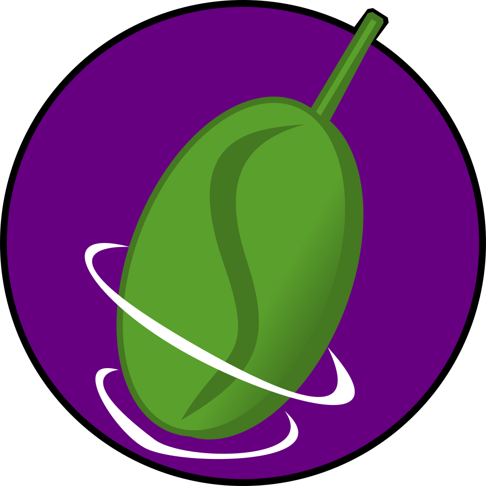

# Spinach lang

Spinach is a quantum programming language.
Its goal is to provide a dedicated language that can simulate and compile code for execution on quantum computers.

[documentation](https://spinachlang.github.io/spinachsite/)

[source](https://github.com/spinachlang/spinachlang)

[examples](https://github.com/spinachlang/spinachlang-algorithms)
