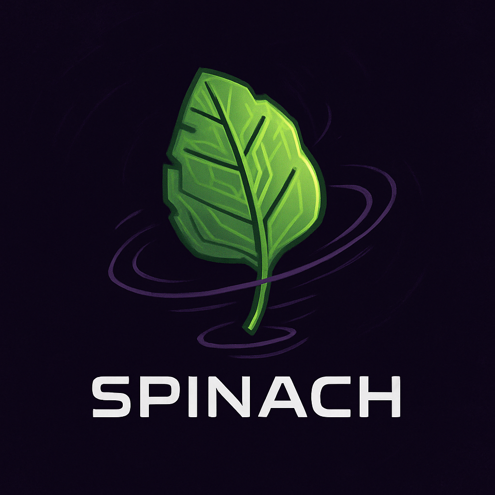

# Spinach lang

Spinach is a quantum programming language.
Its goal is to provide a dedicated language that can simulate and compile code for execution on quantum computers. Spinach also aims to offer tools that allow users to do more with less code.

This is a solo project for now but I will accept contributions when it will have a good base. One thing that I could apreciste help on is the logo. The version we have here is AI generated crap but I would like something similar but with more personality. My idea is a spinach spinning like a top. If you're an artist I would apreciste your contribution.

If you know more then me about quantum computing we could talk about it. I know a bit but i'm still learning about it.
